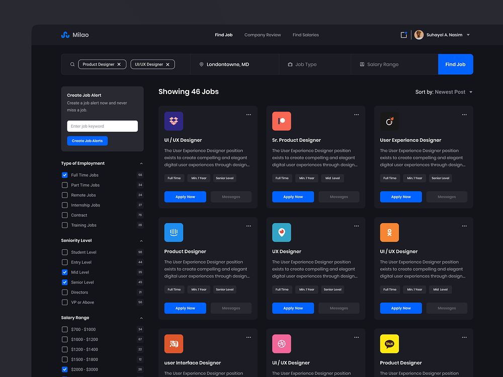

<h1 align="center"> Milao - Job Search Platform </h1>
<h3 align="center"> Isaías Ramos de Oliveira Training</h3>

  Layout constructed to train the contributors on group-based web development.  
  Following general methodologies for commits, structure and stylization.  

  <a href="#🚀-technologies">Technologies</a>&nbsp;&nbsp;&nbsp;|&nbsp;&nbsp;&nbsp;
  <a href="#🔖-layout">Layout</a>&nbsp;&nbsp;&nbsp;|&nbsp;&nbsp;&nbsp;
  <a href="#🔍-related">Related</a>

 

  

## 🚀 Technologies

Technologies used in this the project:

- HTML
- CSS
- Git

## 🔖 Layout

You can see the original layout [HERE](https://dribbble.com/shots/14154823-Job-Search-Platform).

## 🔍 Related

- [Netflix Gamified](https://github.com/IsaiasRamosOliveira/netflax-sala-a) is another project with the same idea made by our training group.